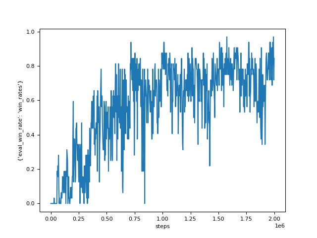
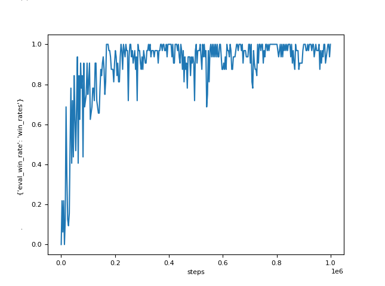
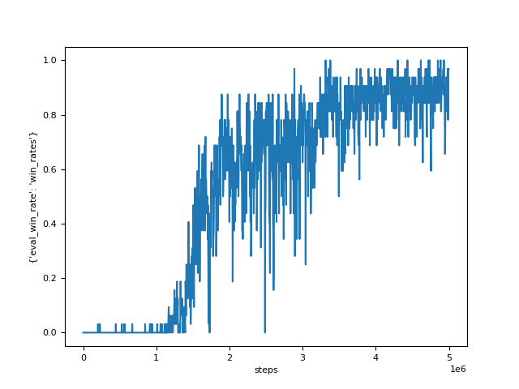

# DPO

## Note

The implementation of the following methods can be found in this codebase:
- [**DPO**: A Fully Decentralized Surrogate for Multi-Agent Policy Optimization](https://openreview.net/forum?id=MppUW90uU2)

## Installation

- 1. install SMAC following https://github.com/oxwhirl/smac
- 2. install Multi-Agent MuJoCo following https://github.com/schroederdewitt/multiagent_mujoco
- 3. install MPE following https://github.com/openai/multiagent-particle-envs
- 4. install required packages: pip install -r requirements.txt 

## How to run

```
 python3 on-policy-main/train_smac.py  --map_name 2s3z --use_eval  --penalty_method True --dtar_kl 0.02   --experiment_name dtar_0.02_V_penalty_2M --num_env_steps 2000000 --group_name dpo --seed 1 --multi_rollout True --n_rollout_threads 1
```
## Results

Here, we provide results in three different SMAC scenarios using default hyperparameters.

--->

## Citation

If you are using the codes, please cite our papers.

[Kefan Su and Zongqing Lu. *A Fully Decentralized Surrogate for Multi-Agent Policy Optimization*. TMLR, 2024](https://openreview.net/forum?id=MppUW90uU2)


    @article{DPO,
    title={A Fully Decentralized Surrogate for Multi-Agent Policy Optimization},
    author={Su, Kefan and Lu, Zongqing},
    journal={Transactions on Machine Learning Research},
    year={2024}
    }
